# OpenAcademia

In this project I am aiming to build a Open Academia System and merit based instead of time based academia.

Some Case studies are such as:

- https://www.wgu.edu/


### Notes

Backend Server

```
https://github.com/NeneWang/json_server_render/blob/main/db.json

```

Live Deployment

```
git checkout -b gh-pages
ng build --configuration=production --base-href "https://nenewang.github.io/open-academia/"
sudo npm install -g angular-cli-ghpages
ngh --dir dist/lista-alumnos

npx angular-cli-ghpages --dir=dist/open-academia
```

### Ng Key Features

- [ ] Authentication
- [ ] ngrx Store Management


## Features

- [ ]  Pipes
  - [ ]  username
  - [ ]  capitalize
- [ ]  Directives
  - [ ]  miniRender: for images, render small previews
  - [ ]  colorCategory renders different colors depending on cateogry type

### Packages

```
ng add @ngrx/store
ng add @ngrx/store-devtools
```

### Image Assets


<a href="https://ibb.co/tqjHpY5"></a>


### Prev

Understanding Modules.

First was creating all the modules.

Some common errors:

-  For some reason, is a good (better idea) to have the Mat Dialog Modul eclared on the prev module e.g. the dialog for courses creation is to be done on `admin/pages/courses.courses.module.ts`

```ts title="courses.module.ts"
import { NgModule } from '@angular/core';
import { CommonModule } from '@angular/common';
import { IndexComponent } from './index/index.component';
import { Routes, RouterModule } from '@angular/router';
import { TableComponent } from './table/table.component';
import { MatDialogModule } from '@angular/material/dialog';
import { CoursesDialogComponentComponent } from '../../components/courses-dialog-component/courses-dialog-component.component';
import { SharedModule } from 'src/app/shared/shared.module';

import { CourseTableComponent } from 'src/app/admin/components/course-table/course-table.component';


const routes: Routes = [
  
  {
    path: 'table',
    component: TableComponent,
  },
  {
    path: '',
    // component: TableComponent,
    component: IndexComponent,
  },
]


@NgModule({
  declarations: [
    IndexComponent,
    TableComponent,
    CoursesDialogComponentComponent,
    CourseTableComponent,
    
  ],
  imports: [
    CommonModule,
    SharedModule,
    RouterModule.forChild(routes),
    MatDialogModule,
  ],
  exports: [RouterModule]
})
export class CoursesModule { }

```

### 2.1 Creating Course Tables


```ts title="course-table-component.ts"
import { Component, EventEmitter, Input, Output } from '@angular/core';
import { Course } from 'src/app/academia/models';

@Component({
  selector: 'app-courses-table',
  templateUrl: './course-table.component.html',
  styleUrls: ['./course-table.component.css'],
})
export class CourseTableComponent {
  @Input()
  dataSource: Course[] = [{
    "id": 1,
    "name": "Algorithms I",
    "description": "This course is an introduction to the design and analysis of algorithms. Topics include asymptotic notation, recurrences and recursion, analysis of algorithms, sorting algorithms, basic data structures, and graph algorithms.",
    "image": "https://i.ibb.co/k4bG2qF/algorithms-1.png",
    "category": "Computer Science",
    "intensity": "High",
    "credits": 4
},];

  @Output()
  editCourse = new EventEmitter();

  @Output()
  deleteCourse = new EventEmitter();

  displayedColumns = ['id', 'name'];
}

```

```ts title="course-table-component.html"
<table mat-table [dataSource]="dataSource" class="mat-elevation-z8">
    <!--- Note that these columns can be defined in any order.
          The actual rendered columns are set as a property on the row definition" -->
  
    <!-- Id Column -->
    <ng-container matColumnDef="id">
      <th mat-header-cell *matHeaderCellDef>#</th>
  
      <td mat-cell *matCellDef="let course">
        {{ course.id }}
      </td>
    </ng-container>
  
    <!-- Name  Column -->
    <ng-container matColumnDef="name">
      <th mat-header-cell *matHeaderCellDef>Nombre</th>
  
      <td mat-cell *matCellDef="let course">
        {{ course.name }}
      </td>
    </ng-container>
  
  
    <!-- Actions Column -->
    <ng-container matColumnDef="actions">
      <th mat-header-cell *matHeaderCellDef>Acciones</th>
  
      <td mat-cell *matCellDef="let course">
        <button [routerLink]="course.id" mat-icon-button color="accent">
          <mat-icon>visibility</mat-icon>
        </button>
  
        <button
          (click)="deleteCourse.emit(course.id)"
          mat-icon-button
          color="warn"
        >
          <mat-icon>delete</mat-icon>
        </button>
  
        <button
          (click)="editCourse.emit(course.id)"
          mat-icon-button
          color="primary"
        >
          <mat-icon>edit</mat-icon>
        </button>
      </td>
    </ng-container>
  
    <tr mat-header-row *matHeaderRowDef="displayedColumns"></tr>
    <tr mat-row *matRowDef="let row; columns: displayedColumns"></tr>
  </table>
  

```

### Get Courses

Syncing the courses

```html title="table.component.html"
<p>table Courses</p>
<br>


<app-courses-table
[dataSource]="(courses$ | async) || []"
></app-courses-table>

<button (click)="addCourse()" >Create Course</button>

```


```ts title="academiaservice.service.ts"

getCourses$(): Observable<Course[]> {
// return of(this.courses);
return this.httpClient.get<Course[]>(`${environment.baseUrl}/course`);

}

```

### Posting Courses


The following code works.

```js
    return this.httpClient
      .post<User>(`${environment.baseUrl}/users`, payload)
      .pipe(concatMap(() => this.getUsers()));

```


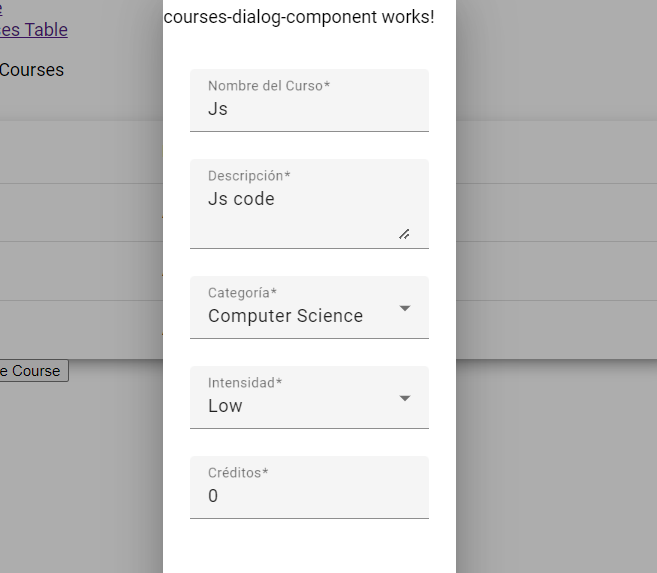

### Deleting

```js
deleteUser(id: number): Observable<User[]> {
    return this.httpClient
      .delete<Object>(`${environment.baseUrl}/users/${id}`)
      .pipe(
        // map(() =>  this.getUsers())
        concatMap(() => this.getUsers())
      );
  }
  ```

  Updated the service:

  ```js
  

  updateCourse(id: number, course: Course){
    return this.httpClient.put<Course[]>(`${environment.baseUrl}/course/${id}`, course).
      pipe(concatMap(() => this.getCourses$()));;
  }

  deleteCourse$(id: number): Observable<Course[]> {
    return this.httpClient.delete<Course[]>(`${environment.baseUrl}/course/${id}`)
      .pipe(concatMap(() => this.getCourses$()));
  }

  getCourseById$(id: number): Observable<Course | undefined> {
    return this.httpClient.get<Course[]>(`${environment.baseUrl}/course/${id}`)
      .pipe(concatMap((courses) => of(courses[0])));
  }
  ```

Setting the methods

```ts title="table.component.ts"
  
<app-courses-table
[dataSource]="(courses$ | async) || []"
(deleteCourse)="deleteCourse($event)"
(editCourse)="editCourse($event)"
></app-courses-table>
```

And now getting the actions to show:

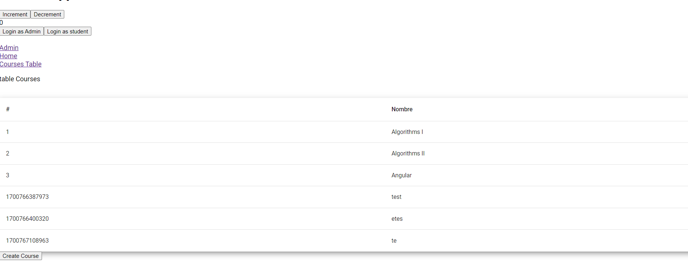


Note you add actions to it

```ts title="course-table.component.ts"
 
displayedColumns = ['id', 'name', 'actions'];
```

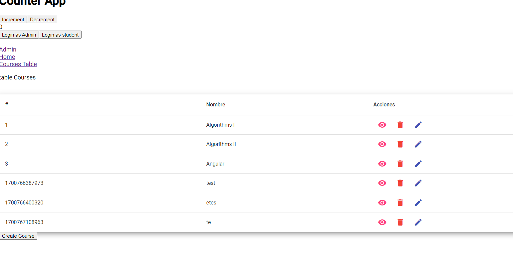


Adding edit Button TO make it work

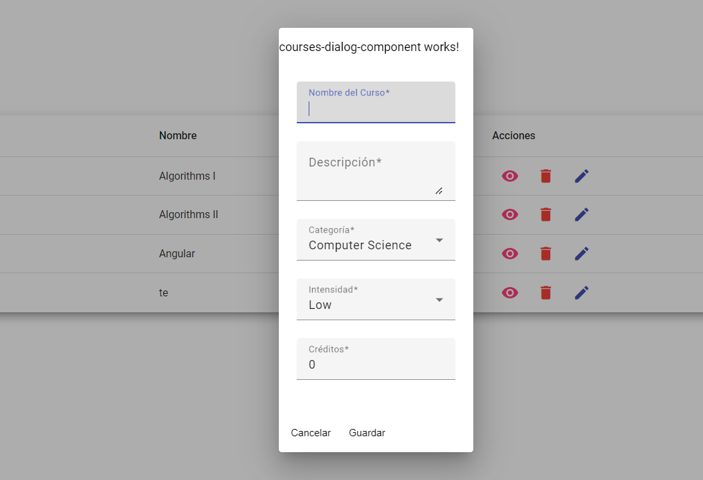


Now what is missing:

## Setting upp the Users Table


1. First we need to create the main compoents
2. Then we have to create the pages and the routings.
   1. First goes the courses in general thats in index.
3. Ranking is also important so that we can navigate the in the ranking as for the main index.


### Show Enrollment status

I am thinking of either building some kind of  check. I can have an set object with the id of the courses taken. Then have an o(1) check for them.


```ts title="course-table.component.ts"

  getEnrolledCourses$(id_user: number): Observable<UserCourse[]> {

    return this.httpClient.get<UserCourse[]>(`${environment.baseUrl}/usercourses?userId=${id_user}`);
  }
```

This is honeslty enough we cna now have on the usage case:

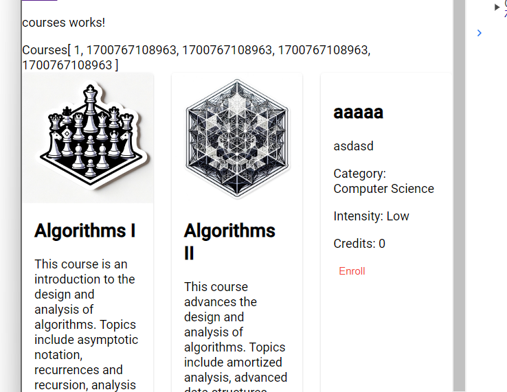


### Creating Sections

1. First you want to have them respecting the sections of the areas of them. 

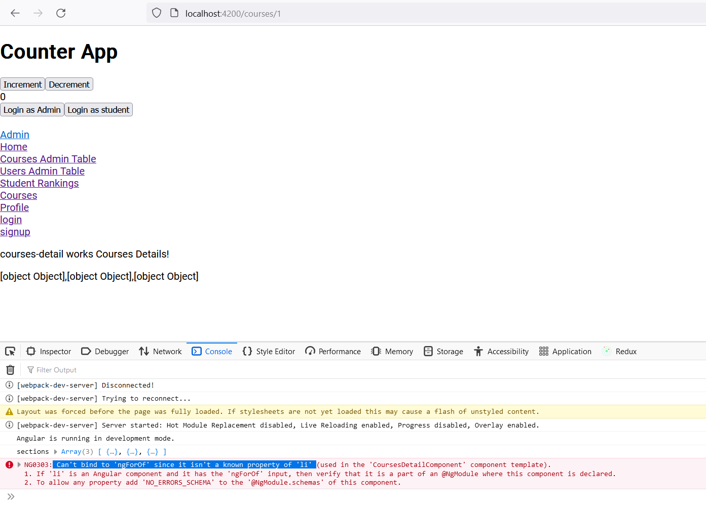

It seems that basic `*ngFor` is not there in the CourseDialog.

```html
<ul>
    <li *ngFor="let prerequisite of course.prequisites">
        {{ prerequisite }}
    </li>
</ul>
```


```
NG0303: Can't bind to 'ngForOf' since it isn't a known property of 'li' (used in the 'CoursesDetailComponent' component template).
1. If 'li' is an Angular component and it has the 'ngForOf' input, then verify that it is a part of an @NgModule where this component is declared.
2. To allow any property add 'NO_ERRORS_SCHEMA' to the '@NgModule.schemas' of this component.
```

It seems that I am supposed to add the declaration somewhere to import the common module:


Lets check

- [x] app.module.ts
- [x] core.module.ts
- [x] admin.module.ts
- [x] users.module.ts
- [x] shared.module.ts
- [x] student.module.ts
- [x] courses.module.ts
- [x] academia.module.ts
- [ ] app-routing.module.ts
- [ ] admin-routing.module.ts
- [ ] studnets-routing.module.ts


It wouldnt really make sesne to have them being reimported on the `routing` type of imports. It makes sense to.

I had a similar problem when it came .

Ok, it seems that I didnt declare it thats why:

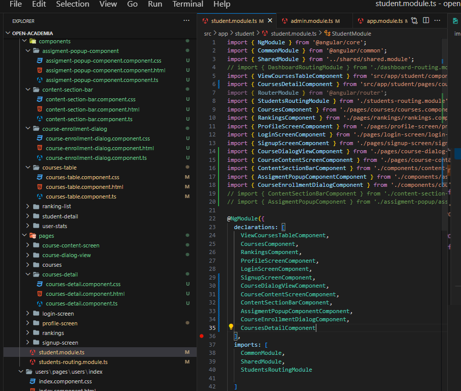


Lets check where am I missing it?

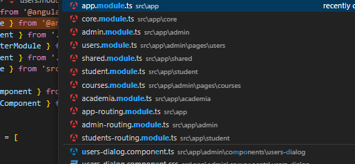


```html
<h3>Courses</h3>

<!-- Courses Subscribed -->


<!-- Mat Cards using the courses thing -->
```


At this point I am strugling with the courses view table.
 Therefore I will continue to just be working with tthe lsit of items and the user information


```js

  userCourses: UserCourse[] = [];

  constructor(
    private academiaserviceService: AcademiaserviceService,
    @Inject(MAT_DIALOG_DATA) public user: User,
  ) {
    academiaserviceService.getEnrolledUserCourses$(user.id).subscribe(
      (userCourse: any) => {
        this.userCourses = userCourse;
        console.log('userCourse', userCourse)
      }
    )
  }
```

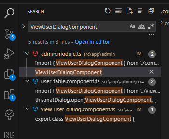


## Fixing the enroll viewable from outside

- Intention is to have the enroll button disabled at least, or that sends you to login, if you are not logged in.


```html
<div mat-dialog-content>
  <h1>{{ course.name }}</h1>
  <p>{{ course.category }} | Intensity: {{ course.intensity }} | Credits: {{course.credits}}</p>

  <p>
    {{ course.description }}
  </p>

  <div *ngIf="course.prequisites">
    <h3>Prerequisites</h3>
    <ul>
      <li *ngFor="let prerequisite of course.prequisites">
        {{ prerequisite }}
      </li>
    </ul>
  </div>

  <div mat-dialog-actions>
    <button mat-button mat-dialog-close>Cancel</button>
    <button  mat-button color="primary" (click)="enrollCourse()">Enroll</button>
  </div>
</div>

```


```ts


  enrollCourse(): void {
    this.MatDialogRef.close(this.course.id);
  }

```

So here

```ts title="courses-table.components"


  openEnrollDialog(course: Course): void {


    if(this.isEnrolled(course.id)){
      this.matDialog
        .open(CourseEnrollmentDialogDetailonlyComponent, {
          data: course,
          width: "90%",
          
        })
        .afterClosed()
        .subscribe({
          next: (result) => {
            if (result) {
              console.log('exit result', result)
              this.enrollCourse.emit(result);
            }
          },
        });

    }else{
      this.matDialog
        .open(CourseEnrollmentDialogComponent, {
          data: course,
          
        })
        .afterClosed()
        .subscribe({
          next: (result) => {
            if (result) {
              console.log('exit result', result)
              this.enrollCourse.emit(result);
            }
          },
        });
    }


```


```
http://localhost:3000/users?_expand=addresses&_embed=schedules
```

```
http://localhost:3000/users?_embed=usercourses
```

```js
[
  {
    "id": 1,
    "first": "Bucky",
    "last": "Roberts",
    "email": "buckyroberts@mail.com",
    "password": "password1",
    "role": "ADMIN",
    "token": "",
    "avatar": "https://img.freepik.com/free-psd/3d-illustration-person-with-sunglasses_23-2149436188.jpg?w=826&t=st=1700594112~exp=1700594712~hmac=5d7a5afc2a327d64e046bf43f816d0d1f98928253eb08eae7636a1917dbe3659",
    "usercourses": [
      {
        "id": 1701743346037,
        "userId": 1,
        "courseId": 4,
        "progress": 100,
        "status": "In Progress",
        "grade": 1,
        "start_date": "2023-12-05T02:29:06.037Z",
        "expire_date": "2023-12-05T02:29:06.037Z",
        "end_date": "2023-12-05T02:29:06.037Z"
      },
      {
        "id": 1701747224146,
        "userId": 1,
        "courseId": 1,
        "progress": 0,
        "status": "In Progress",
        "grade": 0,
        "start_date": "2023-12-05T03:33:44.146Z",
        "expire_date": "2023-12-05T03:33:44.146Z",
        "end_date": "2023-12-05T03:33:44.146Z"
      },
      {
        "id": 1701747226436,
        "userId": 1,
        "courseId": 2,
        "progress": 0,
        "status": "In Progress",
        "grade": 0,
        "start_date": "2023-12-05T03:33:46.436Z",
        "expire_date": "2023-12-05T03:33:46.436Z",
        "end_date": "2023-12-05T03:33:46.436Z"
      }
    ]
  },
  ]
  ```

  The you append the grades to calculate the scores.
  

  - Use the grades to be summed up.

### Understanding Reducers

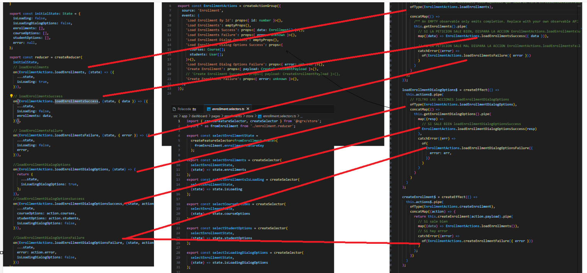

Attack plan: 
1. Follow previous example with enrollments
2. Propagate inot all other cards type of problems

```js

```

## Overall Conclusions

These are things that I have learnt for them to be good practices

- Not to use Shared loading way too much. For different users profile management you should attempt managing by having different modules
- Dont abuse load async. Create components inside and it will automatically match
- POST Http requires of .subsbscribe to actually run.
- Always document whyou are doing. Is good for generating Youtbe's content.
- Make a generalized conclusions section like this one.
- Start the project by creating the services and main ocmponents. and main directions, it doesnt matter if it is uggly.
- Main usage of ``
- Using popups is a bad idea, hint to solve is: making sure that they are declared on the moduled that they are being used.


## Documentation

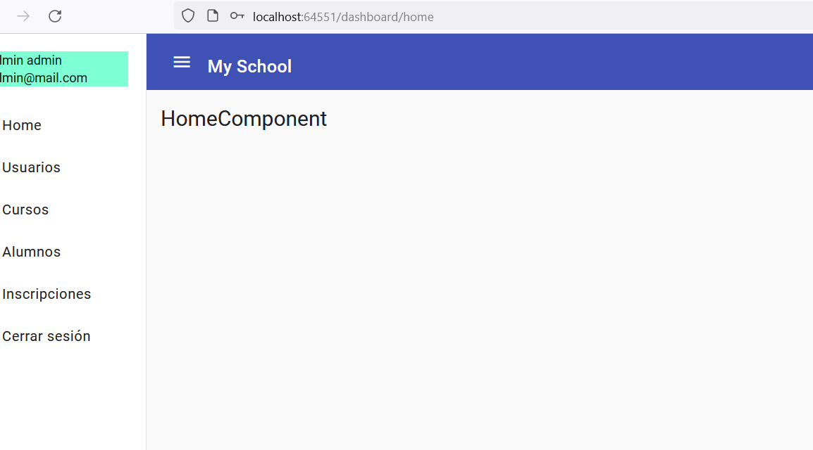

- This is what we want to create the hover on.
- Some kind of drawer that can be used to pick up and show the drawer

```html
<mat-toolbar color="primary">
  <button mat-icon-button (click)="toggleDrawer()">
    <mat-icon>menu</mat-icon>
  </button>
  <span>My App</span>
</mat-toolbar>

<mat-sidenav-container class="example-container">
  <mat-sidenav #sidenav mode="side" opened="true">
    Drawer content
  </mat-sidenav>
  <mat-sidenav-content>
    <router-outlet></router-outlet>
  </mat-sidenav-content>
</mat-sidenav-container>

```

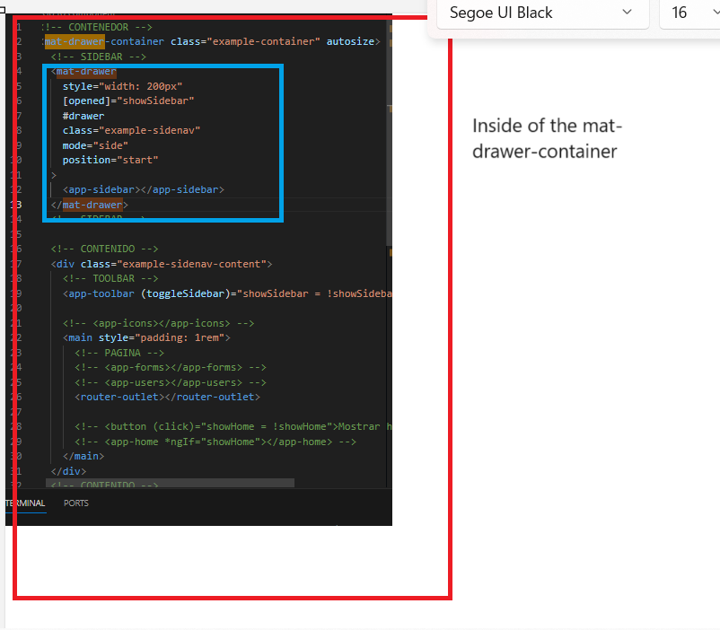

And that worked!


```html title="Readme.md"

<mat-list-item
  routerLink="/profile"
  routerLinkActive
  #profileLink="routerLinkActive"
  [activated]="profileLink.isActive"
>
  <a>Profile</a>
</mat-list-item>
<mat-list-item
  routerLink="/admin/courses"
  routerLinkActive
  #adminCoursesLink="routerLinkActive"
  [activated]="adminCoursesLink.isActive"
>
  <a>Admin</a>
</mat-list-item>


<mat-list-item
  routerLink="/admin/courses/table"
  routerLinkActive
  #coursesAdminTableLink="routerLinkActive"
  [activated]="coursesAdminTableLink.isActive"
>
  <a>Courses Admin Table</a>
</mat-list-item>

<mat-list-item
  routerLink="/admin/users/table"
  routerLinkActive
  #usersAdminTableLink="routerLinkActive"
  [activated]="usersAdminTableLink.isActive"
>
  <a>Users Admin Table</a>
</mat-list-item>

<mat-list-item
  routerLink="/students"
  routerLinkActive
  #studentsLink="routerLinkActive"
  [activated]="studentsLink.isActive"
>
  <a>Student Rankings</a>
</mat-list-item>

<mat-list-item
  routerLink="/courses"
  routerLinkActive
  #coursesLink="routerLinkActive"
  [activated]="coursesLink.isActive"
>
  <a>Courses</a>
  ```